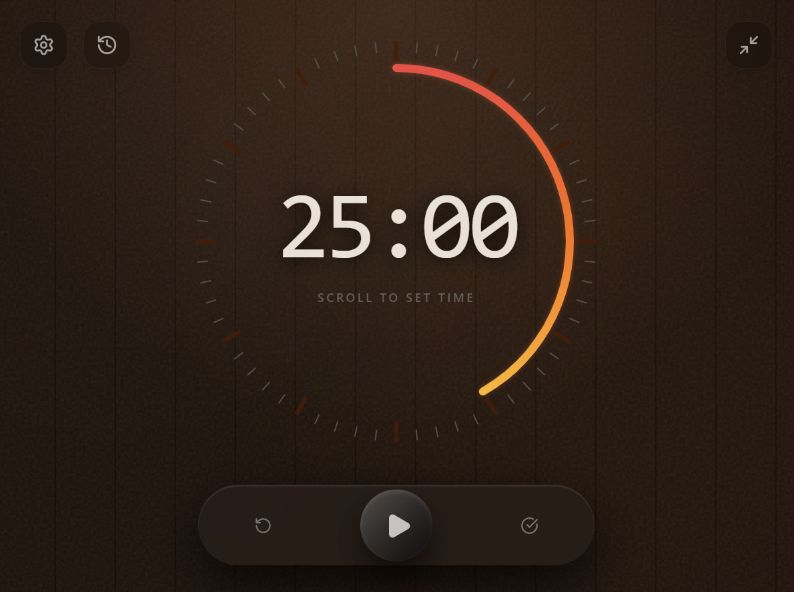

# ZenFocus 🧖‍♂️

**デジタルな日常に、サウナのような「ととのい」を。**

ZenFocusは、サウナの落ち着いた雰囲気をデスクトップにもたらす没入型ポモドーロタイマーです。
「蒸気」や「熱」を感じさせるビジュアルとサウンドで、深い集中状態（ゾーン）へとあなたを誘います。

## ✨ 特徴 (Features)

### 🧖 没入感のある「サウナ」体験

* **深みのあるサウナ室デザイン**: 暗めの木目調と、熾火（おきび）のような温かみのあるグラデーション。
* **立ち昇る蒸気**: 集中タイムが進むにつれて濃くなる、リアルな蒸気アニメーション。
* **ロウリュサウンド**: タイマー終了時には、熱したサウナストーンに水をかけた時のような「ジュワーッ」という心地よい音が鳴り響きます。

### 🎛️ 操作

* **スクロールで時間設定**: タイマーの上でマウスホイールをスクロールするだけで、1分〜60分の間で時間を調整できます。
* **一時停止 (Start/Pause)**: 中央の大きなボタンでタイマーを開始・一時停止できます。
* **リセット (Reset)**: 左側の矢印ボタンでタイマーをリセットし、初期状態に戻します。
* **完了 (Finish)**: 右側のチェックマークボタンで、現在のタイマーを完了させ、セッションを記録します。
* **ミニモード (Mini Mode)**: 右上の縮小アイコンをクリックすると、常に最前面に表示されるコンパクトモードに切り替わります。
* **設定 (Settings)**: 左上の歯車アイコンから、音量やデフォルト時間を設定できます。

### 🖥️ ミニモード

* **コンパクトな常駐モード**: ウィンドウを極小サイズに折りたたみ、画面の隅に常に最前面で表示させておくことができます。作業の邪魔をせず、常に残り時間を確認できます。ミニモードでは常にウインドウが最前面に表示され、タイマーをを確認できます。

### 📊 活動記録

* **日々の記録**: その日の総集中時間を自動で集計。
* **ストリーク（継続日数）**: 毎日の継続を可視化し、モチベーション維持をサポートします。
* **セッション履歴**: 最近の集中セッションの詳細を振り返ることができます。

### ⚙️ 設定

* **時間設定**: タイマーのデフォルト時間設定を変更できます。
* **音量設定**: 終了音の音量を調整できます。

## 📖 使い方

1. **時間を決める**: タイマーサークルにカーソルを合わせ、ホイールをスクロールして集中したい分数をセットします（デフォルト: 25分）。
2. **温める (Start)**: 中央の大きなボタンをクリックしてタイマーを開始します。
3. **集中 (Focus)**: 徐々に蒸気が立ち込め、残り時間を示すエンバーリング（残り火）がゆっくりと減っていきます。
4. **ととのう (Finish)**: タイマーが0になるとロウリュ音が鳴り、セッションが履歴に記録されます。
5. **振り返る**: 履歴アイコンをクリックしてカレンダービューに切り替え、その日の成果や継続日数を確認できます。
